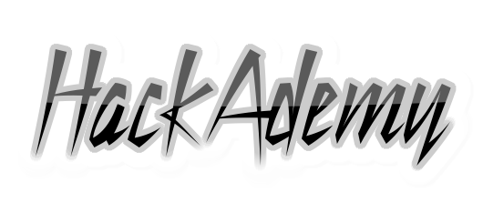

This project aims at setting a `base of information` dealing with common `web appplication weaknesses and vulnerabilities`.

## Organization
In fact, there is a directory dedicated to each vulnerability. Within this, relevant and consistent information are fed. This information is supposed to be both `theorical and technical`; but mostly technical.
Therefore, we are trying, as much as possible, to start from scratch for the best understanding of the readers.

Here is the general structure of each case:
* **Lexic**
* **Overview** 
   * **Acronyms - Definition**
   * **Exploitability**
   * **Impact**
   * **Components (server, client, etc)**
   * **Types**
* **How to test/check for**
   * **Whitebox**
   * **Graybox**
   * **Blackbox**
* **Vulnerability exploitation samples**
* **Presence detection**
* **Countermeasures guidelines**
   * **Server side**
   * **Client side**
   * **Possible policy(ies)**
* **Countermeasures implementation**
* **Common exploitation tools** 

## Progress
* [CSRF](Vuln/CSRF/README.md) : *Done* 
* [HTMLInjection](Vuln/README.md) : *ToDo*
* [Path Traversal](Vuln/README.md) : *ToDo*
* [SQLInjection](Vuln/SQL_Injection/README.md) : *Doing*
* [SSRF](Vuln/README.md) : *ToDo*
* [XPATH injection](Vuln/XPATH/README.md) *ToDo*
* [XSS](Vuln/XSS/README.md) : *Done*
* [XXE](Vuln/XXE/README.md) : *ToDo*

## Contribution
If you want to contribute to our project, we welcome you! :) 

But please, read [this](CONTRIBUTION.md) first.

## License
This project is under `GPLv3 License` which terms can be found [here](LICENSE).
