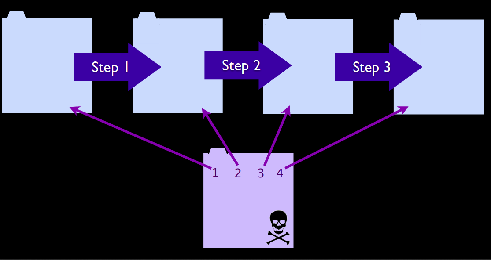

# CSRF - Cross Site Request Forgery
## Plan
* Lexic
* Overview 
   * Acronyms - Definition
   * Exploitability
   * Impact
   * Components (server, client, etc)
   * Types 
* Vulnerability exploitation samples
* Presence detection
* Countermeasures guidelines
   * Server side
   * Client side
   * Possible policy(ies)
* Countermeasures implementation
* Common exploitation tools 
--------
# Overview
## Acronyms - Definition
**CSRF** stands for **C**ross **S**ite **R**equest **F**orgery. It is often abbreviated as **XSRF** and is also known as **one-click attack** or **session riding**. **CSRF** is an attack that forces an end user to **execute unwanted actions** on a web application in which they're **currently authenticated**. **CSRF** attacks specifically target state-changing requests, not theft of data, since the attacker has no way to see the response to the forged request. With a little help of social engineering (such as sending a link via email or chat), an attacker may trick the users of a web application into executing actions of the attacker's choosing. If the victim is a normal user, a successful **CSRF attack** can force the user to perform state changing requests like transferring funds, changing their email address, and so forth. If the victim is an administrative account, **CSRF** can compromise the entire web application. 

## Exploitability
Attacker creates forged HTTP requests and tricks a victim into submitting them via image tags, XSS, or numerous other techniques. If the user is authenticated, the attack succeeds. The only limitation on the success of a **CSRF** attack is the **vicitm's authentication**. An other important point in this kind of attack consists in findind and setting properly the malicious hyperlink.

## Impact 
The following is a list of potential uses for CSRF:
* Transfer money from one bank account to another.
* Use a content management system to add/delete content from a website.
* Change a user’s password.
* Data breaches 
* Add items to a user’s shopping basket.
* Change the delivery address of an orde

## Components
As in common web attacks, the main components in **XSRF** attacks are **client** (web browser) and (web) **server**.
A description of each component will be based on the example below (taken from [incapsula](https://www.incapsula.com/web-application-security/csrf-cross-site-request-forgery.html))

***Explaination***
1. The attack perpetrator builds a malicious link embedding a **fund transfer** performance : this the attack. This action can be only performed by the owner of the account that will undergo the transfer. 
2. As the attacker is the owner, he sends this link to a web visitor by **email** for instance. 
3. The **logged visitor clicks** on the hyperlink and **triggers** the request for funds transfer. And he is logged, the transfer will be realized with his prilege, thus, on his account. This request is sent to the **server** of his bank.
4. The visitor's request is processed by the bank's website and the transfer is done.

***Note*** 

The arrow originating from the **Website** doesn't mean that the result a **CSRF** attack is always notified to the **attacker**. But in this case, it is there to show that the transfer is made from the **Website visitor** to the **attacker**.
In our example, the **Website visitor** is the **client** and the **website** is the **server**.

## CSRF Types 
### One stage CSRF
**One step CSRF** is when the action trigered by the hacker link doesn't need more action to be performed. So in this kind of CSRF the hacker just need to forged a link and send it to the the victim. 

### Multi staged CSRF 
In **multi-step csrf** the action trigered by the hacker link needs more actions from the victim to be completed.So here, the hacker will forged multi links trigered by time or by others events in order for the CSRF to be completely done.

# Exploitation samples
## GET scenario
In this part, we will give a technical description of the figure used in the [Components](#components) section.
## Presence detection
Detection of CSRF flaws is made via **penetration testing** or **code analysis**. 
* **Penetration testing**
* **Code analysis**
# Countermeasures guidelines
## Server side
## Client side
## Policies
# Countermeasures implementation
# Common exploitation tools
