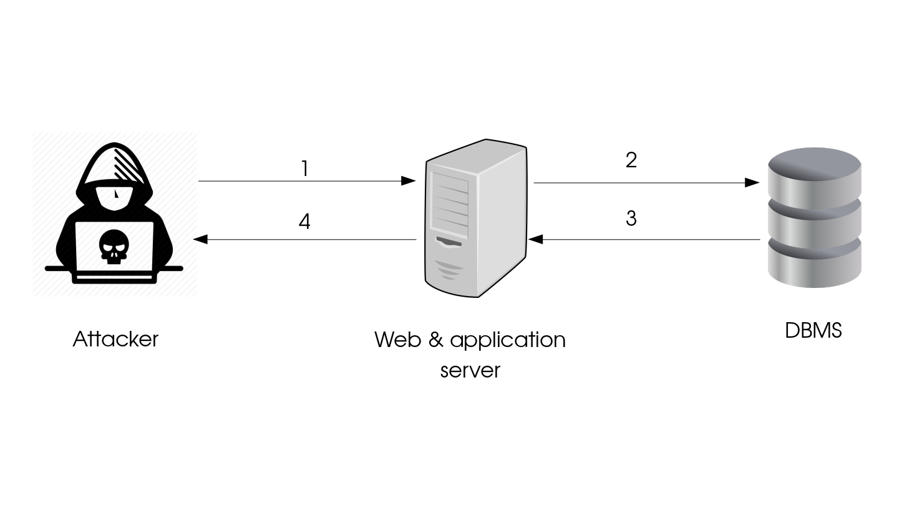

# SQL Injection

## Plan
* Lexic
* Overview 
   * Acronyms - Definition
   * Exploitability
   * Impact
   * Components (server, client, etc)
   * Types 
* Vulnerability exploitation samples
* How to test for SQLi
   * Whitebox
   * Graybox 
   * Blackbox
* Presence detection
* Countermeasures guidelines
   * Server side
   * Client side
   * Possible policy(ies)
* Countermeasures implementation
* Common exploitation tools 

# Lexic

# Overview
## Acronyms - Definition
SQL injection stands for Structured Query Laguage injection. It is usually abbreviated as **SQLi**.

It is an attack that consists of insertion or "injection" of a SQL query via the input data from the client to the application.

A successful SQL injection exploit can:
* read sensitive data from the database, 
* modify database data (Insert/Update/Delete), 
* execute administration operations on the database (such as shutdown the DBMS),
* recover the content of a given file present on the DBMS file system and in some cases issue commands to the operating system. 

## Exploitability
## Impact
## Components
The components identification will be based on the image below.

### Client tier
The attacker uses a **web browser** to forge malicious SQL queries on a website through the inputs offered by this website.
This query is sent to the **wed and application server** for processing. (**Flaw 1 on the image**)

### Web and application server tier
The web and application server receives the prior query. After possible checks and a least of processing, it forwards it to the DBMS entity. (**Flaw 2 on the image**)
Note: The query cannot be run by the web and application server. The DBMS is the entity capable for this. 

### DBMS tier
A DBMS is a Database management system. It has an SQL processing engine. Once the DBMS receives the query it executes the query 
and **possibily** returns the result to the **Web and application server** (**Flaw 3 on the image**). The result **may be** fetched,  formated and sent to the client (web browser). (**Flaw 4 on the image**)
## Types

# Vulnerability explatation samples
# How to test for SQLi
## Whitebox
## Graybox 
## Blackbox
In this section, there two main types of tests that can be performed : manual and logical.
### Logical
This possible thanks to some softwares that do the job and report (and specify) if there are some inputs that SQLi vulnerable.
* SQLiX      
[It](https://www.owasp.org/index.php/Category:OWASP_SQLiX_Project) is a SQL Injection scanner coded in Perl. It is able to:
     * **crawl**, 
     * **detect** SQL injection vectors, 
     * **identify the back-end database**, and 
     * **grab function** call/UDF results (even execute system commands for MS-SQL). 

The concepts in use are different than the one used in other SQL injection scanners. 

[SQLiX](https://www.owasp.org/index.php/Category:OWASP_SQLiX_Project) is able to find **normal and blind SQL injection** vectors and doesn't need to reverse engineer the original SQL request (using only function calls).  

# Presence detection
# Countermeasures guidelines
## Server side
## Client side
## Policy(ies)

# Countermeasures implementation
# Common exploitation tools
# Related attacks 
