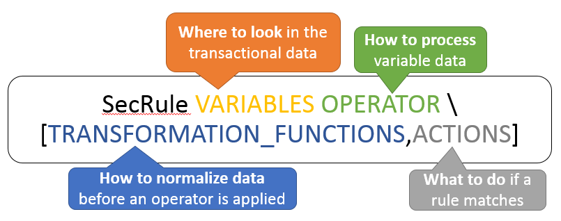

# WAF XSS Counter Measures Implementation 

We will be using the OWASP open source WAF [ModSecurity](modsecurity.md).

## OWASP CRS - Core Rule Set


The **OWASP ModSecurity Core Rule Set (CRS)** is a set of generic attack detection rules for use with **ModSecurity** or compatible web application firewalls (**WAFs**). The CRS aims to protect web applications from a wide range of attacks, **including the OWASP Top Ten**, with a minimum of false alerts. The CRS provides protection against many common attack categories, including:
* SQL Injection (SQLi)
* Cross Site Scripting (XSS)
* Local File Inclusion (LFI)
* Remote File Inclusion (RFI)
* Remote Code Execution (RCE)
* PHP Code Injection
* HTTPoxy
* Shellshock
* Session Fixation
* Scanner Detection
* Metadata/Error Leakages
* GeoIP Country Blocking

In CRS v3.0.2, the rules concerning XSS injections are in the file named as **REQUEST-941-APPLICATION-ATTACK-XSS.conf**.
Before we examine deeply one of these rules, let us figure out the `general syntax of a rule in ModSecurity`.



To block the XSS vectors making use of `javascript uri and tags`, e.g.: 
```HTML
<p style="background:url(javascript:alert(1))">
```
This rule is used:
```CGI
SecRule REQUEST_COOKIES|!REQUEST_COOKIES:/__utm/|REQUEST_COOKIES_NAMES|REQUEST_HEADERS:User-Agent|REQUEST_HEADERS:Referer|ARGS_NAMES|ARGS|XML:
/* "(?i)(?:<(?:(?:apple|objec)t|isindex|embed|style|form|meta)\b[^>]*?>[\s\S]*?|(?:=|U\s*?R\s*?L\s*?\()\s*?[^>]*?\s*?S\s*?C\s*?R\s*?I\s*?P\s*?T\s*?:)" \
	"msg:'XSS Filter - Category 4: Javascript URI Vector',\
	id:941140,\
	severity:'CRITICAL',\
	phase:request,\
	t:none,t:utf8toUnicode,t:urlDecodeUni,t:htmlEntityDecode,t:jsDecode,t:cssDecode,t:removeNulls,\
	rev:'3',\
	ver:'OWASP_CRS/3.0.0',\
	maturity:'1',\
	accuracy:'8',\
	block,\
	ctl:auditLogParts=+E,\
	capture,\
	tag:'application-multi',\
	tag:'language-multi',\
	tag:'platform-multi',\
	tag:'attack-xss',\
	tag:'OWASP_CRS/WEB_ATTACK/XSS',\
	tag:'WASCTC/WASC-8',\
	tag:'WASCTC/WASC-22',\
	tag:'OWASP_TOP_10/A3',\
	tag:'OWASP_AppSensor/IE1',\
	tag:'CAPEC-242',\
	logdata:'Matched Data: %{TX.0} found within %{MATCHED_VAR_NAME}: %{MATCHED_VAR}',\
	setvar:'tx.msg=%{rule.msg}',\
	setvar:tx.xss_score=+%{tx.critical_anomaly_score},\
	setvar:tx.anomaly_score=+%{tx.critical_anomaly_score},\
	setvar:tx.%{rule.id}-OWASP_CRS/WEB_ATTACK/XSS-%{matched_var_name}=%{tx.0}"
```
### Notes :

**FTW - Framework for Testing WAFs**
---
* **Find regressions in WAF** deployments by using continuous integration and issuing repeatable attacks to a WAF
* Provide a **testing framework for new rules into ModSecurity**, if a rule is submitted it MUST have corresponding positive & negative tests
* **Evaluate WAFs** against a common, agreeable baseline ruleset (OWASP)
* **Test and verify custom rules** for WAFs that are not part of the core rule set

[FTW Home page](https://github.com/fastly/ftw)

**WASC OWASP Web Application Firewall Evaluation Criteria Project** 
---
 The [Web Application Firewall Evaluation Criteria Project (WAFEC)](https://www.owasp.org/index.php/Projects/WASC_OWASP_Web_Application_Firewall_Evaluation_Criteria_Project) serves two goals:

* Help stakeholders understand what a WAF is and its role in protecting web sites.
* Provide a tool for users to make an educated decision when selecting a WAF.


[Here](https://coreruleset.org/) is the offcial web site of the OWASP CRS and this is [Github repository](https://github.com/SpiderLabs/owasp-modsecurity-crs).


