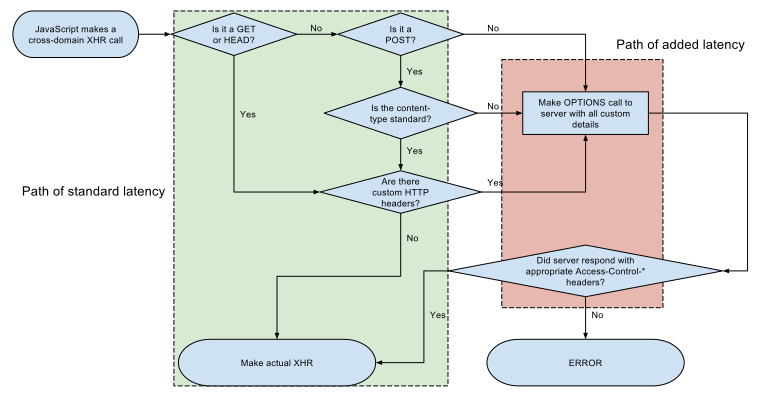

# CORS - Cross Oigin Ressources Sharing 
**CORS** is a mechanism that allows restricted ressources on a web page to be requested from another domain outside the domain from which fisrt the webste was served. CORS defines a way in which a browser and server can interact to fetermine wheter or not it is safe to allow the cross-origin request. The current actively-maintained specification that defines CORS is the **Fetch Living Standard**.

## How it works

The **CORS** standard **describes new HTTP headers** which provide **browsers** and **servers** a way to request remote URLs only when they have permission. Although some validation and authorization can be performed by the server, it is generally the **browser's responsibility to support these headers and honor the restrictions they impose**.

For Ajax and HTTP request methods that can modify data (usually HTTP methods other than GET, or for POST usage with certain MIME types), the specification mandates that browsers "preflight" the request, soliciting supported methods from the server with an HTTP OPTIONS request method, and then, upon "approval" from the server, sending the actual request with the actual HTTP request method. Servers can also notify clients whether "credentials" (including Cookies and HTTP Authentication data) should be sent with requests.

## Header syntax
```
Header-Name : Value
```
Value = {URL, \*}:
* URL : e.g. http://example.com
* \* : anything

## Request headers
* Origin
* Access-Control-Request-Method
* Access-Control-Request-Headers

## Response headers
* Access-Control-Allow-Origin
* Access-Control-Allow-Credentials
* Access-Control-Expose-Headers
* Access-Control-Max-Age
* Access-Control-Allow-Methods
* Access-Control-Allow-Headers

## Workflow illustration chart

